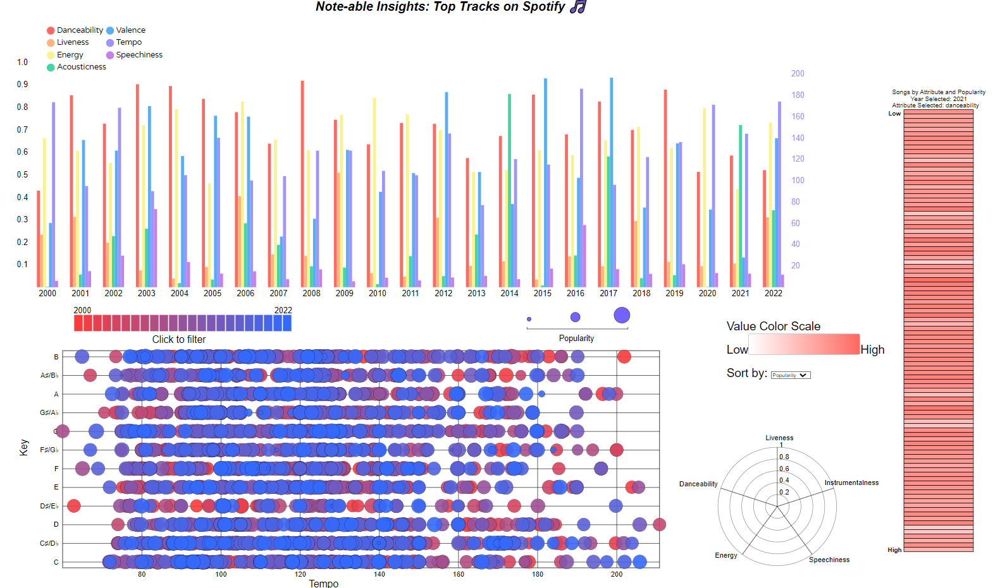

#  Note-able Insights: Top Tracks on Spotify 🎶
****
By: Christian Luca Esposito (12746153), Diego Ayoubzadeh (46614384), Tammy Kim (57998726), Johnny Yang (54351151).

The project aims to analyze and visualize the evolution of music trends by examining Spotify’s top hit playlist 
songs over the years, with Spotify users and music enthusiasts as the target audience.
As a result, we hope to uncover which factors have a high impact on the popularity of songs.

The project aims to replicate this design below:

Sources and Acknowledgements:

- Used (1) to help me with the opacity
- Used (2) for adding the foreign Object for the label
- (3) ChatGPT was used to help with helping out how some css and scatterplot questions
    - "how can I add a border to my graph"
    - "how do i add border to my legend" (border: 1px solid grey;)
    - "how do i add stroke colour in d3"
    - Used to help me add comments and toggle filter
- (4) Used the scatterplot from tutorial to help me figure out how to start and other details.
- (5) This is the database that was used in the project

Sources:
- (1) https://stackoverflow.com/questions/10835500/how-to-change-text-transparency-in-html-css
- (2) https://observablehq.com/@bumbeishvili/foreignobject-typical-usage
- (3) https://chat.openai.com/
- (4) https://codesandbox.io/s/github/UBC-InfoVis/2021-436V-examples/tree/master/d3-linked-charts-dispatcher?file=/js/main.js:431-594
- (5) https://www.kaggle.com/datasets/josephinelsy/spotify-top-hit-playlist-2010-2022
